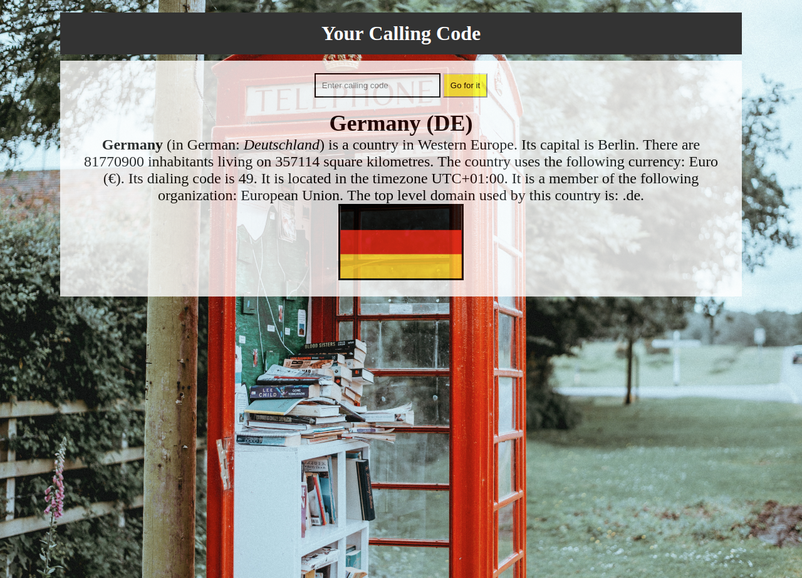

# country-codes

This webpage was created by Stefan Klinkusch at Digital Career Institute using vanilla JavaScript. The page accepts an international calling code and gets the data of the respective country from the [restcountries.eu API](https://restcountries.eu). The data is shown in the DOM.

## Shown data

The app shows
- the name of the country (or region)
- the local name of the country
- the location of the country
- the capital
- the number of inhabitants
- the size of the area
- the currency/currencies with name and sign
- the calling codes
- the timezone(s)
- the organization(s) of which the country is a member
- the top level domain(s)
- the flag

If there is more than one country using the calling code, all countries are shown. If there is no country matching to the calling code, an error message and a skull icon are shown.

## Screenshot

